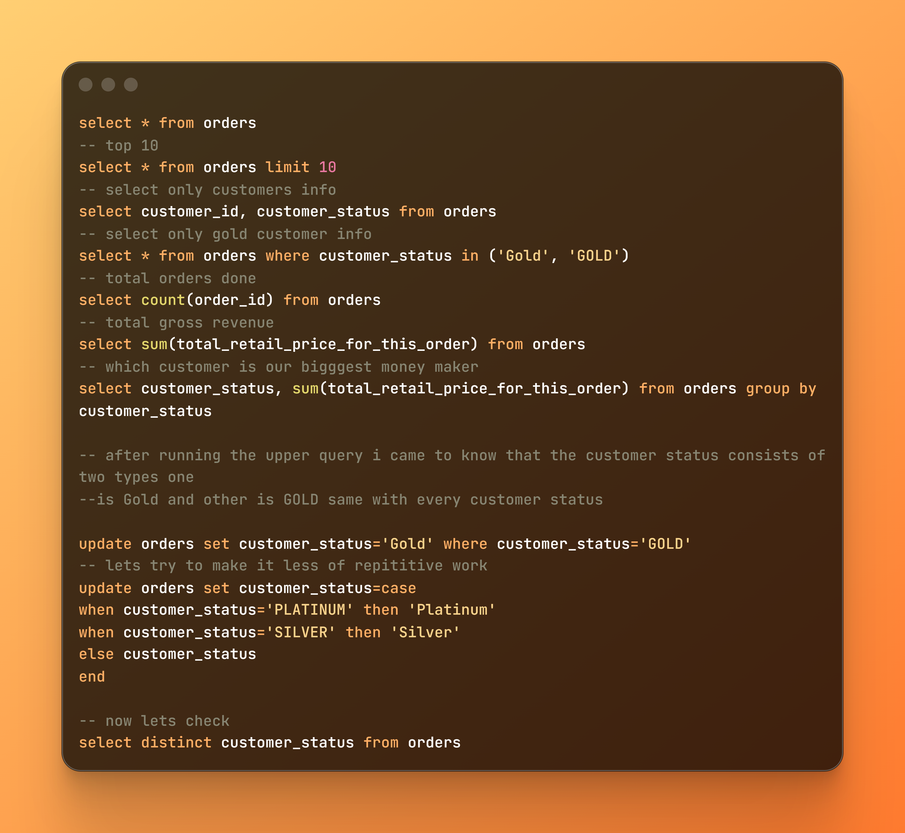
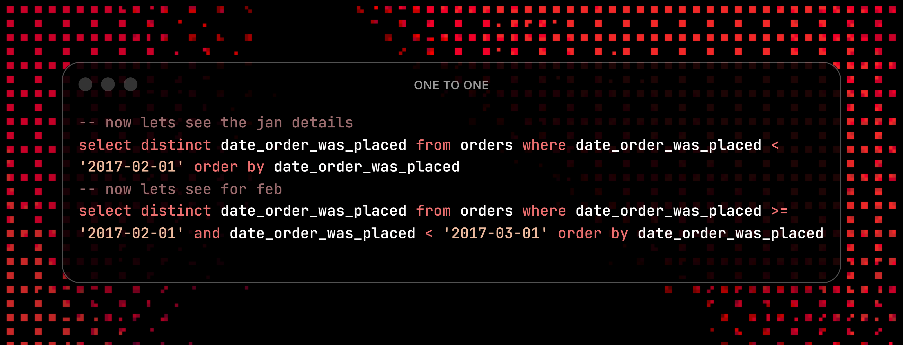
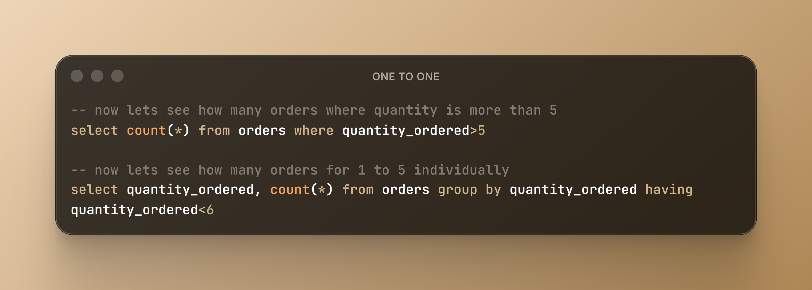

# SQL Practice Log

A structured repository dedicated to documenting my hands-on learning journey, database design patterns, and relational query optimization using PostgreSQL.

## 📁 Repository Structure
* `one_to_one.sql`: Implementing 1:1 relationship constraints using Primary and Foreign Keys to map users to unique documents (Passports).
* `orders_data_cleaning.sql`: Exploring massive transaction datasets, detecting data anomalies, and applying conditional `CASE` updates for text standardization.

## 🛠️ Tech Stack
* **Database Management System:** PostgreSQL
* **Interface Tool:** pgAdmin 4

---

## 🧠 Database Architecture: One-to-One Relationships
This section of the repository contains a hands-on implementation of a relational database schema using PostgreSQL to track users and their passport registries.

### Key Concepts Practiced:
* **Data Integrity Constraints:** Utilizing `UNIQUE` and `FOREIGN KEY` parameters to prevent data corruption and duplicate identity assignments.
* **Join Mechanics:** Comparing standard relational mapping via `INNER JOIN` against relational matrices using `CROSS JOIN`.

### 📊 Visual Script Reference
Below is the optimized, production-ready schema design for this phase:

*The raw script tracking this implementation can be viewed directly in the [one_to_one.sql](./one_to_one.sql) file.*

---

## Retail Sales & Operational Logistics Analysis

### 🎯 Business Objective
In this phase, I analyzed a massive retail order log containing over 185,000 transaction records to calculate gross corporate revenue and identify customer loyalty segments using PostgreSQL.

### 🧹 Data Cleaning & Anomaly Resolution
During initial data exploration, I discovered a text consistency issue where human data entry had split categories into duplicates (e.g., `'GOLD'` vs `'Gold'`, and `'PLATINUM'` vs `'Platinum'`). This anomaly would distort any financial reporting. 

To resolve this, I implemented an optimized data cleaning script utilizing a conditional `CASE` expression to permanently standardize the records across the entire database in a single transaction block.

### 🧠 Core Business Insights Discovered
* **Total Order Volume:** 185,013 individual transactions successfully processed.
* **Gross Corporate Revenue:** Generated a total financial footprint of ₹2,56,41,503.32 (2.56 Crores).
* **Data Integrity:** Standardized customer profiles down to three clean, actionable distinct tiers: Gold, Platinum, and Silver.

### 🖼️ Visual Script Reference
Below is the verified exploration and cleaning workflow implemented in pgAdmin:

*The raw script tracking this implementation can be viewed directly in the [orders_data_cleaning.sql](./orders_data_cleaning.sql) file.*

#### Date Boundary Filtering Script:

### 📊 Time-Series Insights & Data Verification
By isolating the transaction data for individual months, I performed a quality check on how dates are stored in the database:
* **Data Continuity Check:** The queries confirm that the database cleanly transitions from January (`< '2017-02-01'`) into February (`>= '2017-02-01'`) without any missing dates or format breaking.
* **Distinct Date Tracking:** Using `SELECT DISTINCT` allowed me to verify that orders were actively being placed on consecutive days throughout the entire month, ensuring there are no dead zones or system logging gaps in early 2017.

*The raw script tracking this implementation can be viewed directly in the [orders_data_cleaning.sql](./orders_data_cleaning.sql) file.*

---

## 📦 Order Quantity Distribution Analysis

### 🎯 Objective
To analyze customer buying behavior and distinguish between standard consumer retail habits and bulk commercial purchases within the dataset.

### 🔍 SQL Methodology
To profile the order volumes without cluttering the report, I implemented two distinct filtering techniques to isolate specific item limits:
* **Bulk Order Tracking:** Utilized a row-level `WHERE` clause filtering system to capture and count transactions containing more than 5 items.
* **Individual Volume Breakdown:** Implemented a `GROUP BY` collection paired with an aggregate `HAVING` constraint to isolate smaller item distributions (quantities 1 through 5) dynamically.

#### Quantity Distribution Workflow Script:

### 📊 Operational Insights Discovered
* **Row-Level Pre-Filtering:** By filtering columns via `WHERE`, the engine computes rapid item totals before execution, making bulk analysis faster on heavy transaction logs.
* **Aggregate Post-Filtering:** Grouping data and applying the `HAVING` condition allows the business to safely isolate individual small-scale metrics without modifying or dropping high-volume commercial rows from the overall table infrastructure.
