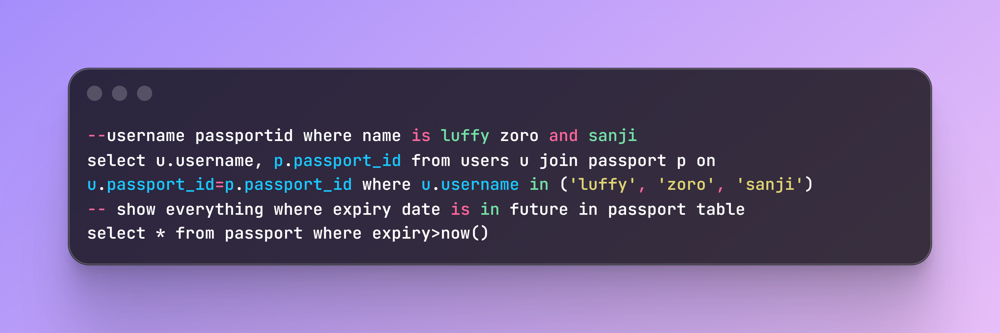
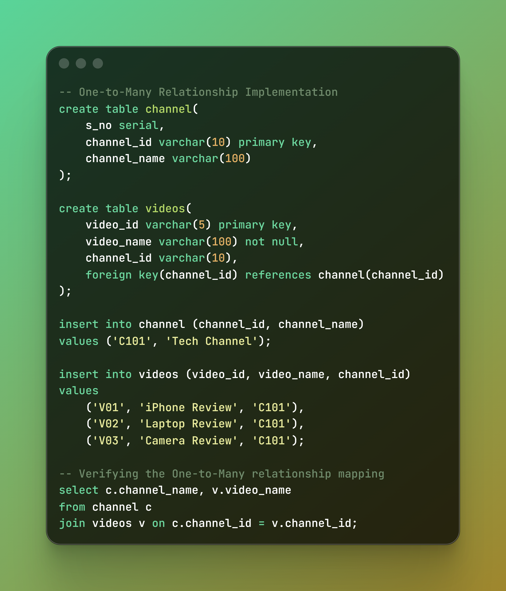
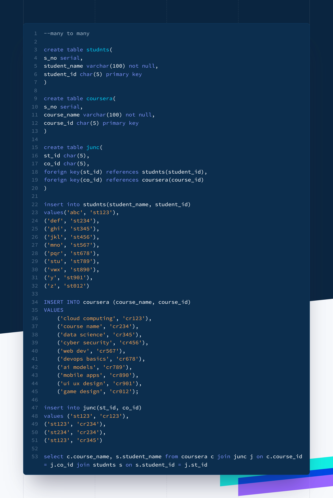
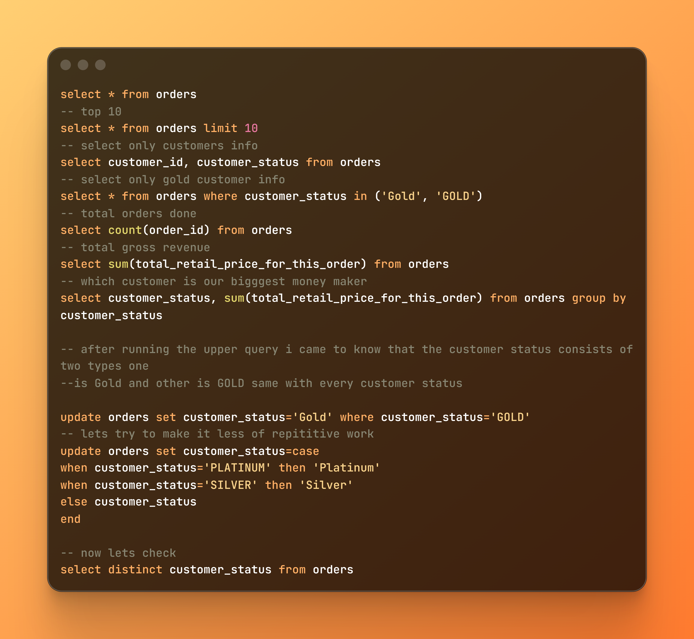
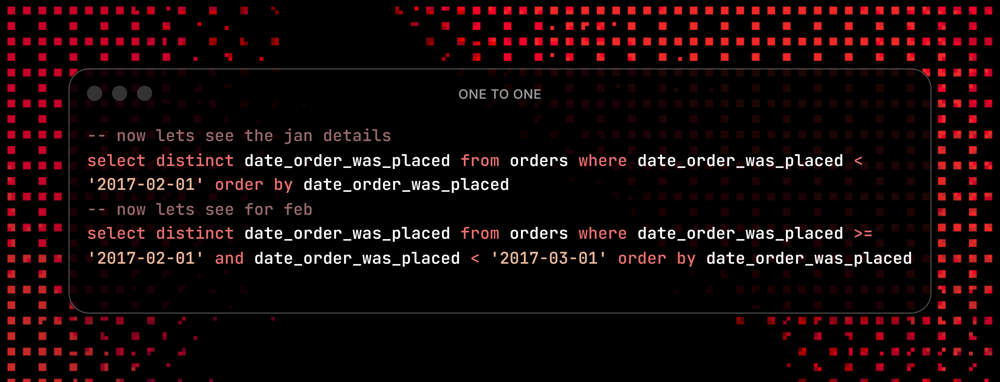
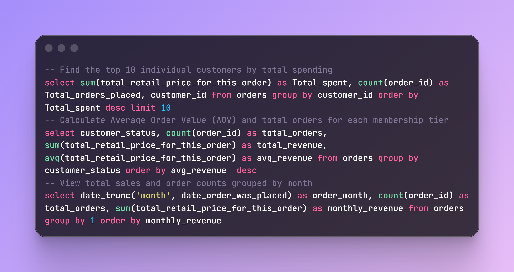
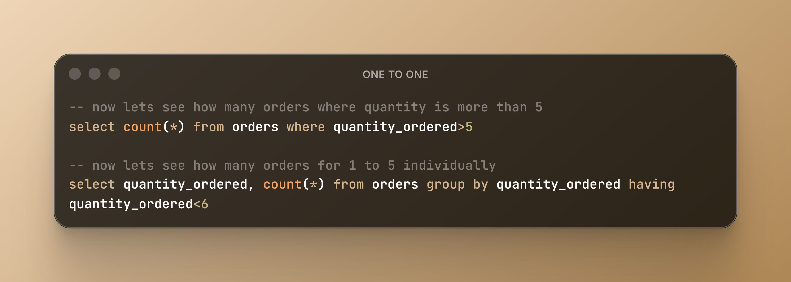

# SQL Practice Log

A structured repository dedicated to documenting my hands-on learning journey, database design patterns, and relational query optimization using PostgreSQL.

## Repository Structure
* `one_to_one.sql`: Implementing 1:1 relationship constraints using Primary and Foreign Keys to map users to unique documents (Passports).
* `one_to_many.sql`: Designing a 1:M constraint system linking dynamic entity nodes (YouTube Channels to hosted Videos) with relational cascading mechanics.
* `many_to_many.sql`: Implementing a M:M schema using a junction table to map student enrollments to platform courses dynamically.
* `orders_data_cleaning.sql`: Exploring massive transaction datasets, detecting data anomalies, and applying conditional `CASE` updates for text standardization.

## Tech Stack
* **Database Management System:** PostgreSQL
* **Interface Tool:** pgAdmin 4

---

## Database Architecture: One-to-One Relationships
This section of the repository contains a hands-on implementation of a relational database schema using PostgreSQL to track users and their passport registries.

### Key Concepts Practiced:
* **Data Integrity Constraints:** Utilizing `UNIQUE` and `FOREIGN KEY` parameters to prevent data corruption and duplicate identity assignments.
* **Join Mechanics:** Comparing standard relational mapping via `INNER JOIN` against relational matrices using `CROSS JOIN`.
* **Conditional Row Filtering:** Applying precise `IN` string matching and relative timestamp boundaries (`> NOW()`) to extract active, targeted documentation profiles.

### Visual Script Reference
Below is the optimized, production-ready schema design for this phase:

#### Target Profile and Expiry Verification Script:

*The raw script tracking this implementation can be viewed directly in the [one_to_one.sql](./one_to_one.sql) file.*

---

## Database Architecture: One-to-Many Relationships
This module expands on relational design by structuring a foundational **One-to-Many (1:M)** cardinality system—modeling how real-world data points correlate asynchronously (e.g., a creator platform architecture).

### Key Concepts Practiced:
* **Parent-to-Child Mapping:** Enforcing database schema restrictions where a single parent record (`channel`) can possess zero, one, or multiple dependent child records (`videos`).
* **Foreign Key Referential Integrity:** Mapping child rows dynamically using structural table constraints to prevent orphan data entry.
* **Relational Data Retrieval:** Writing clean `INNER JOIN` statements with concise table aliasing to rebuild nested models back into unified datasets.

### Visual Script Reference
Below is the production-ready script snippet showcasing the architecture and entity mapping validation:

*The raw script tracking this implementation can be viewed directly in the [one_to_many.sql](./one_to_many.sql) file.*

---

## Database Architecture: Many-to-Many Relationships
This module covers advanced relational design by building a **Many-to-Many (M:M)** cardinality system—modeling complex corporate environments where independent entities intersect fluidly (e.g., students enrolling in multiple professional courses).

### Key Concepts Practiced:
* **Junction Table Implementation:** Setting up an intermediary bridge table (`junc`) to split a complex many-to-many connection into two clean, manageable one-to-many relationships.
* **Composite Referential Integrity:** Mapping twin independent foreign keys simultaneously (`st_id` and `co_id`) to maintain hard relational links back to parent directories.
* **Multi-Bridge Relational Joins:** Writing multi-layered `JOIN` sequences running through the junction hub to reconstruct overlapping data vectors into clear, human-readable summary grids.

### Visual Script Reference
Below is the validated schema query script checking cross-entity structural alignments:

*The raw script tracking this implementation can be viewed directly in the [many_to_many.sql](./many_to_many.sql) file.*

---

## Retail Sales & Operational Logistics Analysis

### Business Objective
In this phase, I analyzed a massive retail order log containing over 185,000 transaction records to calculate gross corporate revenue, isolate consumer purchasing power, and track high-level performance trends across core marketing segments using PostgreSQL.

### Data Cleaning & Anomaly Resolution
During initial data exploration, I discovered a text consistency issue where human data entry had split categories into duplicates (e.g., `'GOLD'` vs `'Gold'`, and `'PLATINUM'` vs `'Platinum'`). This anomaly would distort any financial reporting. 

To resolve this, I implemented an optimized data cleaning script utilizing a conditional `CASE` expression to permanently standardize the records across the entire database in a single transaction block.

### Core Business Insights Discovered
* **Total Order Volume:** 185,013 individual transactions successfully processed.
* **Gross Corporate Revenue:** Generated a total financial footprint of ₹2,56,41,503.32 (2.56 Crores).
* **Data Integrity:** Standardized customer profiles down to three clean, actionable distinct tiers: Gold, Platinum, and Silver.

### Visual Script Reference
Below is the verified exploration and cleaning workflow implemented in pgAdmin:

*The raw script tracking this implementation can be viewed directly in the [orders_data_cleaning.sql](./orders_data_cleaning.sql) file.*

#### Date Boundary Filtering Script:

### Time-Series Insights & Data Verification
By isolating the transaction data for individual months, I performed a quality check on how dates are stored in the database:
* **Data Continuity Check:** The queries confirm that the database cleanly transitions from January (`< '2017-02-01'`) into February (`>= '2017-02-01'`) without any missing dates or format breaking.
* **Distinct Date Tracking:** Using `SELECT DISTINCT` allowed me to verify that orders were actively being placed on consecutive days throughout the entire month, ensuring there are no dead zones or system logging gaps in early 2017.

---

## Advanced Retail Performance & Customer Segmentation

### SQL Methodology
To convert the standardized data landscape into actionable operational intelligence, I built out targeted aggregation scripts focusing on specific corporate growth metrics:
* **VIP Customer Profiling:** Executed an aggregate tracking query using `SUM(total_retail_price_for_this_order)` alongside a descending sort and a hard `LIMIT 10` boundary to instantly extract the top 10 highest-spending individual consumers.
* **Membership Tier Basket Yield (AOV):** Grouped transaction counts and total revenue arrays by customer loyalty tiers using `AVG()` to calculate the exact Average Order Value generated per check-out group.
* **Time-Series Revenue Truncation:** Implemented PostgreSQL's `DATE_TRUNC('month', ...)` engine tool to automatically bucket raw timestamps into clean calendar blocks to isolate sequential revenue generation.

#### Advanced Metrics Workflow Blueprint:

### Strategic Value Extracted
* **Granular Personalization:** Isolating individual high-spending customer IDs provides immediate targets for premium account management and strategic retention campaigns.
* **Segment Worth Analysis:** Calculating structural AOV reveals that evaluating a tier's baseline volume alone is insufficient; tracking per-transaction basket sizes determines which membership level drives the highest item-to-margin efficiency.
* **Automated Trend Slicing:** Leveraging `DATE_TRUNC` removes the administrative overhead of writing repetitive date boundary parameters, generating broad historical trends instantly.

*The raw script tracking this implementation can be viewed directly in the [orders_data_cleaning.sql](./orders_data_cleaning.sql) file.*

---

## Order Quantity Distribution Analysis

### Objective
To analyze customer buying behavior and distinguish between standard consumer retail habits and bulk commercial purchases within the dataset.

### SQL Methodology
To profile the order volumes without cluttering the report, I implemented two distinct filtering techniques to isolate specific item limits:
* **Bulk Order Tracking:** Utilized a row-level `WHERE` clause filtering system to capture and count transactions containing more than 5 items.
* **Individual Volume Breakdown:** Implemented a `GROUP BY` collection paired with an aggregate `HAVING` constraint to isolate smaller item distributions (quantities 1 through 5) dynamically.

#### Quantity Distribution Workflow Script:

### Operational Insights Discovered
* **Row-Level Pre-Filtering:** By filtering columns via `WHERE`, the engine computes rapid item totals before execution, making bulk analysis faster on heavy transaction logs.
* **Aggregate Post-Filtering:** Grouping data and applying the `HAVING` condition allows the business to safely isolate individual small-scale metrics without modifying or dropping high-volume commercial rows from the overall table infrastructure.
